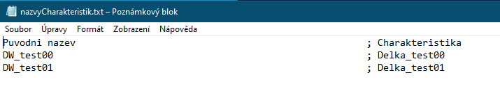

# Skripty
## `extractFilenames.ps1`
### Popis
Skript `extractFilenames.ps1` prohledá všechny soubory ve specifikované složce, nahradí předponu `DW_` v názvech souborů předponou `Delka_` a vytvoří seznam názvů souborů spolu s jejich novými názvy na základě zadaných filtrů. Skript zapisuje výsledky do textového souboru v aktuálním pracovním adresáři.

### Použití
1. **Zadejte cestu ke složce**: Skript se zeptá na cestu ke složce, kterou chcete prohledat. Ujistěte se, že složka existuje.

2. **Zadejte slova pro filtraci**: Skript umožňuje zadat slova, která mají být použita k filtrování názvů souborů. Po zadání všech slov stiskněte Enter pro ukončení zadávání.

3. **Výstup**: Skript vytvoří textový soubor `nazvyCharakteristik.txt` v aktuálním pracovním adresáři, který obsahuje původní názvy souborů a jejich nové názvy s odpovídajícími předponami.

### Ukazka

## `renamePrefix.ps1`
### Popis
Skript `renamePrefix.ps1` slouží k přidání specifikované předpony ke všem souborům v zadané složce a jejích podadresářích. Skript přidá předponu pouze k těm souborům, které ji ještě nemají. Skript je užitečný pro hromadné přejmenování souborů podle zadaného vzoru.

### Použití
1. **Zadejte cestu ke složce**: Skript se zeptá na cestu k cílové složce, kterou chcete prohledat. Ujistěte se, že zadaná složka existuje.

2. **Zadejte předponu**: Skript se dále zeptá na předponu, kterou chcete přidat k názvům souborů. Předpona bude přidána pouze k souborům, které ji ještě neobsahují.

3. **Rekurzivní přejmenování**: Skript prohledá zadanou složku i všechny její podadresáře a přidá předponu ke všem odpovídajícím souborům.